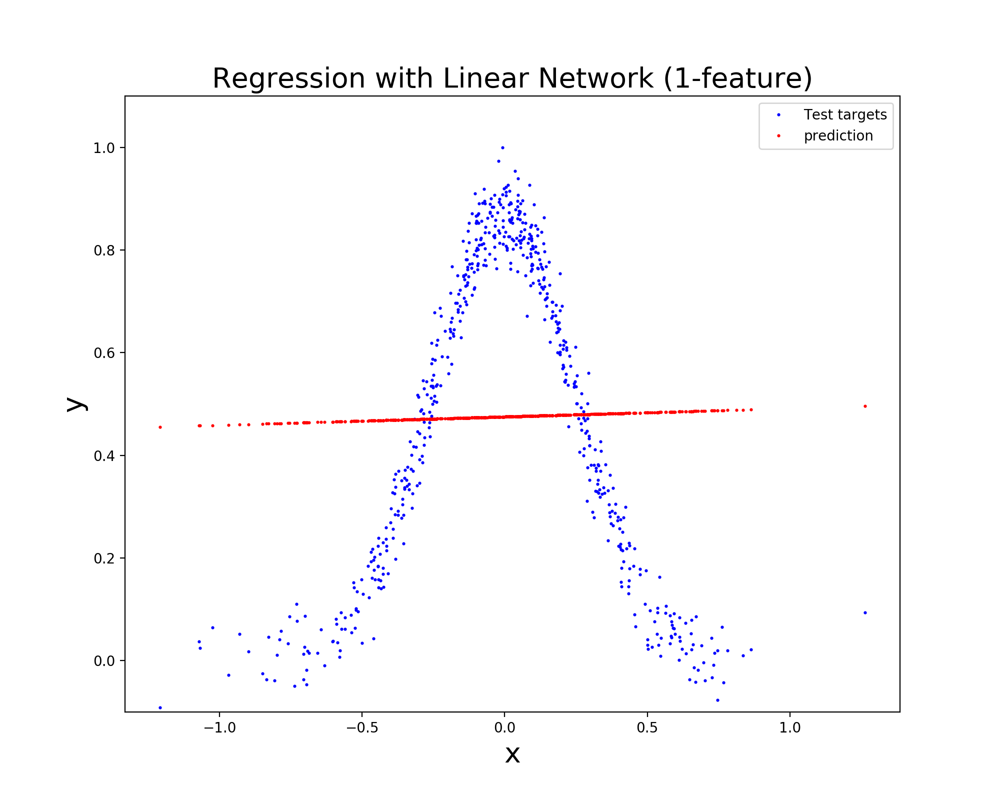
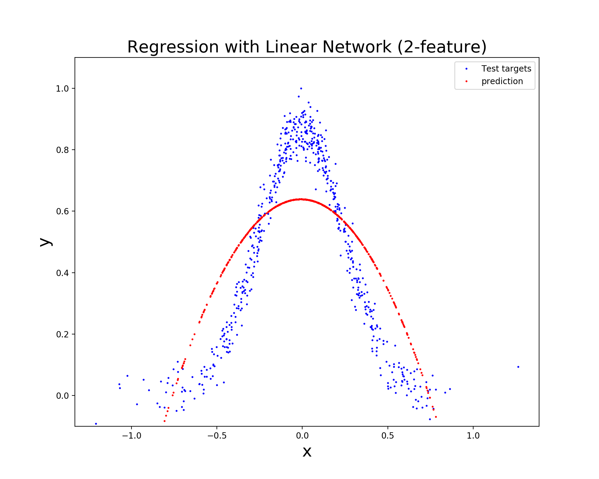

# Assignment3: Building Your Own Neural Network Module with NumPy!

In this part of the assignment, you will implement a neural network yourself.
As you go on, you can use this README.md file as a guideline that walks you through the basic skeleton codes,
and you'll also see what your parts are in completing this neural network module.

More specifically, you are going to

- [**(E1)**](../neural-net#part-i-derivation-of-the-gradient-descent-weight-update-rule) Convince yourself of the derivation of the weight updates used in the Backpropagation algorithm: read [Derivation.pdf](./Derivation.pdf) file and make sure you understand the derivation.
- Implement Layer [**(E2)**](../neural-net#implement-layer-activation-and-loss-classes), Activation [**(E3)**](../neural-net#implement-layer-activation-and-loss-classes) and Loss [**(E4)**](../neural-net#implement-layer-activation-and-loss-classes) classes, which entails filling in feed forward & backpropagation functions based on the derivation.
- [**(E5)**](../neural-net#implement-nesterov-accelerated-gradient) Implement SGD optimizer with Nesterov accelerated gradient.
- [**(E6)**](../neural-net#play-with-your-code) Explore an autoencoder to see how a Neural Network model is learning the 0-7 integers. 
- [**(E7)**, **(E8)**](../neural-net#e7-1-d-toy-regression-problem) Experiment with the regression **(E7)** and classification **(E8)** problems, then report your results.<br>
Make sure that you complete all the exercises **(E1)** through **(E8)**!

To give you an idea how would you use this module for training a neural network (once you have correctly filled in all missing parts), starter codes for **(E6)**, **(E7)** and **(E8)** are given in separate files ([E6_autoencoder.ipynb](./E6_autoencoder.ipynb), [E7_regression.ipynb](./E7_regression.ipynb), [E8_mnist_classification.ipynb](./E8_mnist_classification.ipynb)).
When you have correctly implemented **(E2)** - **(E5)**, you should be able to replicate the sample results given there.

Now, let's begin with some math!
## Part I: Derivation of the Gradient Descent Weight Update Rule
**(E1)** Instead of having you work on deriving the equations necessary for implementation, we decided to give you the derivation.
However, it is **critical** that you understand what is going on to complete the assignment.
<br>
### Vectorized weight update rules
For the detailed step-by-step derivation, see [this PDF file](./Derivation.pdf). Also, [Chapter 4 of Tom Mitchell's text book](http://profsite.um.ac.ir/~monsefi/machine-learning/pdf/Machine-Learning-Tom-Mitchell.pdf) gives great explanation as well (you can also find the PDF of the chapter on Quercus). Note that we need to develop vectorized notations because they suit modern computing libraries such as NumPy for efficient computation. Furthermore, GPUs are excellent for conducting (dense) matrix operations, so you'd always want to work with vectorized implementations whenever possible. Those who are not so familiar with vector and matrix derivatives, please refer to the [Matrix Cookbook](https://www.math.uwaterloo.ca/~hwolkowi/matrixcookbook.pdf).

The main results that we are going to use are as follow:

<p align="center">
  
</p>

### Derivatives of the squared loss and the cross entropy loss

<p align="center">
  
</p>

As indicated in the PDF file, we have the softmax output in the case of the Cross-entropy loss, whereas in MSE loss, we use linear outputs (no activation).

## Part II: Implementation of Neural Net
From here, you need to add codes to where indicated.
### Implement Layer, Activation and Loss classes
**(E2)** Open [**_layer.py_**](./layer.py) file and fill in __forward__ and __backward__ functions.<br>
**(E3)** Open [**_activation.py_**](./activation.py) file and fill in __forward__ and __backward__ functions.<br>
**(E4)** Open [**_loss.py_**](./loss.py) file and fill in __diff_loss__ functions of MSELoss and CrossEntropyLoss classes.

### Implement Nesterov accelerated gradient
**(E5)** Open [**_optim.py_**](./optim.py) file which defines SGD, RMSProp and Adam optimizers.
You are already given the implementations of vanila SGD, RMSProp and Adam.
Consulting those classes as well as the explanation given below, implement Nesterov accelerated gradient method in the SGD class.
You may find [cs231n lecture note](http://cs231n.github.io/neural-networks-3/#sgd) particularly useful for this purpose.

### Play with your code
**(E6)** Open [*E6_autoencoder.ipynb*](./E6_autoencoder.ipynb) and follow the instruction in the file.

**(E7)** Open [*E7_regression.ipynb*](./E7_regression.ipynb) and follow the instruction in the file.

**(E8)** Open [*E8_mnist_classification.ipynb*](./E8_mnist_classification.ipynb) and follow the instruction in the file.

#### (E6) Autoencoder
According to [wikipedia](https://en.wikipedia.org/wiki/Autoencoder), an autoencoder is
> a type of artificial neural network used to learn efficient data codings in an unsupervised manner. The aim of an autoencoder is to learn a representation (encoding) for a set of data, typically for dimensionality reduction ...

You can also think that the supervision of an autoencoder is coming from the input data itself.
The example discussed during the lecture was to auto-encode an integer in the range of 0 to 7 using a single hidden layer with 3 units. Let's do it ourselves and see what the model is learning. When it comes to the input encoding, we can directly use the integer values, or turn them into one-hot encoded vectors.
In the latter, we can use the cross entropy loss rather than MSE loss.
See [*E6_autoencoder.ipynb*](./E6_autoencoder.ipynb) file for details (do **(E6)** at the end of the notebook).

#### (E7) 1-D Toy Regression Problem
Here's a 1-dimensional nonlinear function that you want to predict, which is generated by the code below (see [*E7_regression.ipynb*](./E7_regression.ipynb)).

 

```python
def regression(N=2000):
    np.random.seed(1)
    X = 0.5 * np.random.randn(N, 1) + 0.1
    X = 0.75 * X - 0.1

    Y = -(8 * X ** 2 + 0.1 * X + 0.1)
    Y = np.exp(Y) + 0.05 * np.random.randn(N, 1)
    Y /= np.max(np.abs(Y))
    return X, Y
```

Clearly, the linear function is not capable of learning the nonlinearity. However, it is possible to augment the feature X with its polynomials, e.g. . The 2nd figure above is the result you would get if you augmented X with its quadratic term. Although this is way better than having only one feature, it's hard to say that the model has learned enough to make sensible predictions (especially at the extremes).

**(Your turn)** Without having to bother with feature engineering, you can definitely improve the test performance by, for example, introducing nonlinear activation functions, changing the network architecture, adjusting the learning rate, training more epochs, and (or) using a different optimizer.. So, **it's your turn to try different configurations of the network.** *Experiment with more than 3 configurations of these to get better test performance (test RMSE), and report your trials by summarizing the configurations and performance in a **table**. Additionally, **plot** the test targets and predictions as in the above figures.*

#### (E8) Improving Performance in the MNIST Classification

Let us now look at the famous [MNIST hand-written digit dataset](http://yann.lecun.com/exdb/mnist/). Click the link on the left to see the detailed description of the dataset and the task. Look at [*E8_mnist_classification.ipynb*](./E8_mnist_classification.ipynb), where a single-layer (no hidden layer) linear neural network model is trained to predict correct classes of the hand-written digits. Note that this model is nothing but the logistic regression, but surprisingly, it achieves more than 91% test accuracy!

```python
Epoch 1/5	error=0.48863	Test accuracy: 0.8972
Epoch 2/5	error=0.33068	Test accuracy: 0.9128
Epoch 3/5	error=0.31043	Test accuracy: 0.9146
Epoch 4/5	error=0.29940	Test accuracy: 0.9168
Epoch 5/5	error=0.29452	Test accuracy: 0.9151
```

**(Your turn)** However, you can definitely improve the test performance by, for example, introducing nonlinear activation functions, changing the network architecture, adjusting the learning rate, training more epochs, and (or) using a different optimizer. **It's your turn to try different configurations of these!**

*Experiment with more than 3 configurations of these to get better test performance, and report your trials by summarizing the configurations and performance in a table.* (You can achieve *at least* 96% accuracy pretty easily.)


## Part III: Tutorial
This is a tutorial which walks you through the given codes. You'll see that this module is developed in such a way that you can easily build a customized network that supports a wide variety of training configurations, thanks to the object-oriented programming (OOP) style.
For example, adding a layer is as simple as
```python
nn = NeuralNetwork()
nn.add(FCLayer(x.shape[1], 50))         # add a layer with 50 hidden nodes
```

Similarly, you can easily switch to different types of optimizers (SGD with momentum or Nesterov momentum, RMSProp, and Adam) and compare the results. Now, let's look at the module in detail.

#### Parameters ([param.py](./param.py))
```python
class Parameter:
    def __init__(self, value):
        """
        A wrapper for parameters. For weights, value has the shape [in_dim, out_dim], whereas
        for biases, the shape is [out_dim, ].
        :param value:     (numpy.ndarray) initial values of parameters
        """
        self.value = value
        self.shape = value.shape
        self.grad = None                # store gradient during backpropagation
```
This is the **Parameter** class which is a wrapper for all parameters (i.e., weights and biases). You'll see that when initializing a fully-connected layer, you are going to instantiate **Parameter** objects with some initial values. Another thing to note is *self.grad* which will contain the gradient of the loss w.r.t. the parameter.

#### Layers ([layer.py](./layer.py))
```python
import numpy as np
from abc import ABC, abstractmethod
class Layer(ABC):
    """
    Base class of layers: FCLayer, Activation and Dropout.
    """
    @abstractmethod
    def forward(self, input_data, mode):
        raise NotImplementedError

    @abstractmethod
    def backward(self, delta_n):
        """
        :param delta_n: the delta from the next layer
        """
        raise NotImplementedError
```
Then we have an abstract class **Layer**, which is inherited by **FCLayer**, **Dropout** and **Activation** classes. As you can see, you cannot instantiate this class directly, but it rather sets the basic structure that all child classes should follow.

##### Methods
- **forward**: this is used when you feed forward inputs. It will receive *input_data* which is a numpy array whose row corresponds to each sample in a batch. You need to cache the input data so that you can use it later in **backward** method.

- **backward**: the gradient of the loss with respect to weights (and bias) in a **Layer** object should be computed in this method. It receives the error from the next layer (*delta_n*) and combines it with the *self.input_data* (that was stored during the forward pass) to compute the *delta* (which should then be passed down to the inner layers) as well as the gradients.

Now, let's look at how the child classes of **Layer** is implemented.
#### FCLayer (fully-connected layer)
```python
class FCLayer(Layer):
    def __init__(self, input_size, output_size, initialization='normal', uniform=False):
        """
        :param input_size:      (int)   the number of nodes in the previous layer
        :param output_size:     (int)   the number of nodes in 'this' layer
        :param initialization:  (str)   whether to use Xavier initialization
        :param uniform:         (bool)  in Xavier initialization, whether to use uniform or truncated normal distribution
        """
        if initialization == 'xavier':
            # Xavier initialization followed the implementation in Tensorflow.
            fan_in = input_size
            fan_out = output_size
            n = (fan_in + fan_out) / 2.0
            if uniform:
                limit = math.sqrt(3.0 / n)
                weights = np.random.uniform(-limit, limit, size=(fan_in, fan_out))
                bias = np.zeros((1, output_size))
            else:
                trunc_std = math.sqrt(1.3 / n)
                a, b = -2, 2                            # truncated between [- 2 * std, 2 * std]
                weights = stats.truncnorm.rvs(a, b, loc=0.0, scale=trunc_std, size=(fan_in, fan_out))
                bias = np.zeros((1, output_size))
        else:
            weights = np.random.randn(input_size, output_size)
            bias = np.random.randn(1, output_size)

        self.weights = Parameter(weights)               # instantiate Parameter object by passing the initialized values
        self.bias = Parameter(bias)                     # instantiate Parameter object by passing the initialized values
        self.param = [self.weights, self.bias]          # store the weight and bias to a list

    def forward(self, input_data, mode):
        """
        If self.weights.shape = (in, out), then
        :param input_data:      (numpy.ndarray, shape=[batch_size, in]) the output from the previous layer
        :return: output         (numpy.ndarray, shape=[batch_size, out])
        """
        n = input_data.shape[0]             # size of mini-batch
        self.input_data = input_data        # store the input as attribute (to use in backpropagation)

        ########## Your code goes here ##########
        output =
        ##########         end         ##########

        return output

    def backward(self, delta_n):
        """
        If self.weights.shape = (in, out), then
        :param delta_n:         (numpy.ndarray, shape=[batch_size, out]) the delta from the next layer
        :return delta:          (numpy.ndarray, shape=[batch_size, in]) delta to be passed to the previous layer
        """
        ########## Your code goes here ##########
        delta =
        dEdW =
        dEdb =
        ##########         end         ##########

        # Store gradients
        self.weights.grad = dEdW
        self.bias.grad = dEdb
        return delta
```
This is the fully-connected layer object. Hence, in the **forward** method, you should combine *input_data* passed from the previous layer with *self.weights* and *self.bias* to produce *output*.<br>
In **backward** method, you need to compute *delta* as well as gradients w.r.t. *self.weights* and *self.bias* (*dEdW* and *dEdb*, respectively). <br>
Note that you are not going to update the parameters here; instead, the gradients are stored as an attribute *grad* of *self.weights* and *self.bias* (e.g., *self.weights.grad*). Later, an **Optimizer** will update all parameters of all layers in the network.

You have different options of initializing the weights of a layer. Note that you can give *initialization* and *uniform* arguments when instantiating a **FCLayer** object (see *def \_\_init\_\_()*). By default, weights and bias will be sampled from the standard normal. However, if you set *initialization='xavier'*, you can use [Xavier initialization](http://proceedings.mlr.press/v9/glorot10a/glorot10a.pdf). According to [TensorFlow documentation](https://www.tensorflow.org/versions/r1.15/api_docs/python/tf/contrib/layers/xavier_initializer), this initializer is designed to keep the scale of the gradients roughly the same in all layers. When *uniform=True*, initial values will be sampled from a uniform distribution, which was proposed in the original paper. On the other hand, when it's set to False, a truncated normal distribution will be used. You can see the effect of initialization by turning on and off *xavier* when experimenting with MNIST data.

Finally, note that the created weights are stored in a list *self.param*, which will later be accessed by **Optimizer** for gradient descent updates.

#### Activations ([activation.py](./activation.py))
```python
from layer import Layer
class Activation(Layer):
    def __init__(self, act, act_prime):
        """
        :param act:             (function) activation function
        :param act_prime:       (function) derivative of the activation function
        """
        self.act = act
        self.act_prime = act_prime

    def forward(self, input_data, mode):
        """
        :param input_data:      (numpy.ndarray, shape=[batch_size, # nodes]) output from the previous FCLayer
        :return: output:        (numpy.ndarray, shape=[batch_size, # nodes])
        """
        self.input_data = input_data

        ########## Your code goes here ##########
        output =
        ##########         end         ##########

        return output

    def backward(self, delta_n):
        """
        Compute and pass the delta to the previous layer
        :param delta_n:         (numpy.ndarray, shape=[batch_size, # nodes]) the delta from the next layer
        :return:                (numpy.ndarray, shape=[batch_size, # nodes]) delta to pass on to the previous layer
        """
        ########## Your code goes here ##########
        delta =
        ##########         end         ##########

        return delta
```
This **Activation** class also inherits the **Layer** class because we can deem the **Activation** as a proper layer. During the forward pass, it modifies *input_data* and passes it to the next layer. During backward pass, the activation layer receives *delta* from the next layer, modifies the error and hands it over to the previous layer.

Let's say you want to build a network consisting of a single hidden layer and a ReLu output. In that case, you will write:
```python
from utils import relu, relu_prime
nn = NeuralNetwork()
nn.add(FCLayer(in_dim, hidden_dim))
nn.add(Activation(act=relu, act_prime=relu_prime))
nn.add(FCLayer(hidden_dim, out_dim))
```
As you can see, you should pass *act* and *act_prime* (activation function and its derivative, respectively) to *Activation* object when instantiating it. These functions are defined in '[*utils.py*](./utils.py)' file, so go ahead and check how they are defined!

#### Losses ([loss.py](./loss.py))
```python
from abc import ABC, abstractmethod
class Loss(ABC):
    @abstractmethod
    def loss(self, pred, target):
        """
        Computes the loss function values by comparing pred and target
        :param pred:        (numpy.ndarray) the output of the output layer (after activation in MSELoss, whereas
                                            before activation in CrossEntropyLoss)
        :param target:      (numpy.ndarray) the labels
        :return:            (numpy.ndarray) the loss
        """
        raise NotImplementedError

    @abstractmethod
    def diff_loss(self, pred, target):
        """
        Computes the derivative of the loss function, i.e., delta
        :return:            (numpy.ndarray) delta
        """
        raise NotImplementedError
```
This is an abstract class for losses. You need to implement **MSELoss** and **CrossEntropyLoss** classes which inherit **Loss**. Apparently, the cross entropy loss and the softmax output are always used in tandem (note that the softmax function reduces to the sigmoid in binary classification). Hence, you can see below that **CrossEntropyLoss** combines the softmax output with the cross entropy loss. See the [derivation PDF](./Derivation.pdf) for details.

```python
from utils import softmax
class MSELoss(Loss):
    def loss(self, pred, target):
        ########## Your code goes here ##########
        loss =
        return loss
        ##########         end         ##########

    def diff_loss(self, pred, target):
        ########## Your code goes here ##########
        delta =
        return delta
        ##########         end         ##########

class CrossEntropyLoss(Loss):
    """
    This class combines the cross entropy loss with the softmax outputs as done in the PyTorch implementation.
    The return value of self.diff_loss will then be directly handed over to the output FCLayer (not to Activation layer).
    """
    def loss(self, pred, target):
        # Get the softmax output
        pred = softmax(pred)
        ########## Your code goes here ##########
        loss =
        return loss
        ##########         end         ##########

    def diff_loss(self, pred, target):
        ########## Your code goes here ##########
        delta =
        return delta
        ##########         end         ##########
```

#### Optimizers ([optim.py](./optim.py))
Finally, it's time to update our network weights! To this end, we have the **Optimizer** class.
```python
class Optimizer(ABC):
    def __init__(self, parameters, lr, clipvalue):
        """
        A base class for optimizers. An Optimizer object should be initialized with trainable Parameter objects
        of the model
        :param parameters:          (list) a list of param.Parameter objects of the neural net
        :param lr:                  (float) learning rate
        :param clipvalue:           (float or None) threshold value when clipping gradients (optional)
        """
        self.param_lst = parameters
        self.learning_rate = lr
        self.clipvalue = clipvalue

    @abstractmethod
    def step(self):
        """
        A method which actually updates all the values of Parameters.
        Each Optimizer object should have its own implementation of this method.
        """
        raise NotImplementedError
```
As you can see, this is an abstract class, and each Optimizer should have its own implementation of *step* function. An important thing is that you have to pass a list of **Parameters** that you want to update with the **Optimizer** when instantiating any of **Optimizer** objects. Here, we'll show you how SGD, RMSProp, and Adam optimizers are defined. And you will fill in where the Nesterov accelerated gradient update should happen.

##### SGD
```python
class SGD(Optimizer):
    def __init__(self, parameters, lr,
                 clipvalue=None,
                 momentum=False,
                 nesterov=False,
                 mu=0.9,
                 **kwargs):
        """
        A SGD optimizer (optionally with nesterov/momentum).
        :param parameters:          (list) list of Parameter
        :param lr:                  (float) learning rate
        :param clipvalue:           (float or None) threshold value when clipping gradients
        :param momentum:            (bool) whether to use momentum
        :param nesterov:            (bool) whether to use Nesterov Accelerated Gradient
        :param mu:                  (float) momentum parameter used for 'momentum' or 'nesterov' (default: 0.9)
        :param kwargs:              (additional paramters)
        """
        # Link the Optimizer with Parameters, and set up some attributes
        super(SGD, self).__init__(parameters, lr, clipvalue=clipvalue)
        if nesterov and momentum:
            raise ValueError("Either momentum or nesterov should be turned on, not both.")

        if nesterov or momentum:
            # the momentum parameter *mu*
            self.mu = mu

            # initialize velocity of parameters to zero
            for param in self.param_lst:
                param.velocity = np.zeros(param.shape, dtype=np.float32)

        self.nesterov = nesterov
        self.momentum = momentum
        self.kwargs = kwargs

        # which norm to use in gradient clipping (default is 2-norm)
        self.ord = self.kwargs['ord'] if 'ord' in self.kwargs else 2

    def step(self):
        # clip gradient values (see torch.nn.utils.clip_grad_norm_ function)
        total_norm = 0
        if self.clipvalue is not None:
            for param in self.param_lst:
                param_norm = LA.norm(param.grad, ord=self.ord)
                total_norm += param_norm ** self.ord
            total_norm = total_norm ** (1. / self.ord)
            clip_coef = self.clipvalue / (total_norm + 1e-6)
            if clip_coef < 1:
                for param in self.param_lst:
                    param.grad *= clip_coef

        # gradient descent step
        for param in self.param_lst:
            # no updates happen when there's no gradient information
            if param.grad is None:
                continue

            # momentum or Nesterov Accelerated Gradient update
            if self.momentum or self.nesterov:
                v_prev = param.velocity.copy()
                if self.momentum:
                    param.velocity = self.mu * v_prev - self.learning_rate * param.grad
                    descent = param.velocity

                # Implement Nesterov accelarted gradient
                ########## Your code goes here ##########
                else:
                    descent =
                ##########         end         ##########

            # ordinary gradient descent (w/o momentum)
            else:
                descent = -self.learning_rate * param.grad

            # update
            param.value += descent
```
The **SGD** optimizer is the most basic optimizer that takes gradient descent steps as per the current gradient values of **Parameters** with a specified learning rate. Additionally, it can have momentum updates, in which case you can tune the momentum parameter *mu*. Another option implemented here is the gradient clipping. When the sum of norms of all gradient vectors in a network exceeds *clipvalue*, every gradient is clipped in such a way that the direction of the gradient vector is retained. This may prevent the exploding gradient issue, resulting in stabler training (in some cases). Consult [PyTorch](https://pytorch.org/docs/stable/_modules/torch/nn/utils/clip_grad.html) implementation of gradient clipping for details.

Remember that, during the backward step, we have stored the gradients to *self.weights.grad* and *self.bias.grad*. Now, the **SGD** optimizer will go through the list of **Parameters** and update the values of them (*self.weights.value* and *self.bias.value*) accordingly. Your part is to fill in the Nesterov accelerated gradient update. Again, you will find [this note](http://cs231n.github.io/neural-networks-3/#sgd) particularly useful.

Although learning rate annealing is not implemented in this module, often it is critical to properly decrease the magnitude of the learning rate according to some schedule. Since tuning the learning rate is one of the most time-consuming and exhausting job, researchers have come up with brilliant ideas that make (kind of) automatic tuning of learning rates possible. These are often called per-parameter adaptive learning rate methods. Among other methods, here's the implementation of RMSProp and Adam optimizer. Look at the above cs231n note for detailed description.

```python
class RMSProp(Optimizer):
    def __init__(self, parameters, lr,
                 decay_rate=0.9,
                 clipvalue=None,
                 **kwargs):
        """
        A RMSProp optimizer
        :param parameters:          (list) list of Parameter
        :param lr:                  (float) learning rate
        :param decay_rate:          (float) RMSProp specific parameter (default = 0.9)
        :param kwargs: additional arguments
        """
        # Link the Optimizer with Parameters, and set up some attributes
        super(RMSProp, self).__init__(parameters, lr, clipvalue=clipvalue)

        # Initialize Parameter.meansquare which keeps track of the moving average of squared gradients
        for param in self.param_lst:
            param.meansquare = np.zeros(param.shape, dtype=np.float32)

        self.decay_rate = decay_rate

    def step(self):
        # Loop through Parameters and update their values
        for param in self.param_lst:
            param.meansquare = self.decay_rate * param.meansquare + (1 - self.decay_rate) * param.grad**2
            descent = -self.learning_rate * param.grad / (np.sqrt(param.meansquare) + 1e-6)
            param.value += descent

class Adam(Optimizer):
    def __init__(self, parameters, lr,
                 beta1=0.9,
                 beta2=0.999,
                 eps=1e-8,
                 clipvalue=None):
        """
        An Adam optimizer
        :param parameters:          (list) list of Paramters of the neural network
        :param lr:                  (float) learning rate
        :param beta1:               (float) Adam specific parameter
        :param beta2:               (float) Adam specific parameter
        :param eps:                 (float) Adam specific parameter
        """
        # Link the Optimizer with Parameters, and set up some attributes
        super(Adam, self).__init__(parameters, lr, clipvalue=clipvalue)

        # Initialize Parameter.m_t and Parameter.v_t: moving average of first and second moments of gradient
        for param in self.param_lst:
            param.m_t = np.zeros(param.shape, dtype=np.float32)
            param.v_t = np.zeros(param.shape, dtype=np.float32)
            param.step = 0
        self.beta1 = beta1
        self.beta2 = beta2
        self.eps = eps

    def step(self):
        # Loop through Parameters and update their values
        for param in self.param_lst:
            param.step += 1
            bias_correction1 = 1 - self.beta1 ** param.step
            bias_correction2 = 1 - self.beta2 ** param.step

            param.m_t = self.beta1 * param.m_t + (1 - self.beta1) * param.grad
            param.v_t = self.beta2 * param.v_t + (1 - self.beta2) * (param.grad**2)

            denom = np.sqrt(param.v_t) / math.sqrt(bias_correction2) + self.eps
            step_size = self.learning_rate / bias_correction1

            descent = -step_size * param.m_t / denom
            param.value += descent
```

#### NeuralNetwork module ([model.py](./model.py))
FINALLY!! Now, we are going to bring all pieces together into the **NeuralNetwork** module.
```python
class NeuralNetwork:
    def __init__(self):
        """
        A module that combines all the components of a neural network.
        """
        self.layers = []        # FCLayer and activation layers will be appended
        self._parameters = []
        self.loss = None        # the loss function
        self.diff_loss = None   # and its derivative
        self.optimizer = None

    def add(self, layer):
        """
        Append layer and layer.param (if exists) to self.layer and self._parameters, respectively.
        :param layer:       (layer.Layer) a Layer object to be appended to self.layers
        """
        self.layers.append(layer)

        # FCLayer object has Parameter object stored as layer.param (=[layer.weights, layer.bias])
        try:
            self._parameters.extend(layer.param)
        # no parameters in Activation object
        except:
            pass

    def parameters(self):
        """
        Getter for parameters in the network
        :return:            (list) self._parameters (a list of parameters of each layer)
        """
        return self._parameters

    def set_loss(self, loss):
        """
        Method for setting loss function and its derivative.
        :param loss:        (Loss) a Loss object that has 'loss' and 'diff_loss'
        """
        self.loss = loss.loss
        self.diff_loss = loss.diff_loss
```
As we've already seen, you should first instantiate a **NeuralNetwork** object, then add **Layers** to it. When a **Layer** is added to **NeuralNetwork**, the **Layer** is appended to *NeuralNetwork.layers*, while its **Parameter** is added to *NeuralNetwork._paramters* (see **add()** method). You can access this list via *self.parameters()* call. You also need to specify which **Loss** and **Optimizer** to use by **set_loss** and **set_optimizer** methods:
```python
nn = NeuralNetwork()
nn.add(FCLayer(in_dim, out_dim))
loss = MSELoss()
nn.set_loss(loss)
optimizer = optim.SGD(nn.parameters(), lr=0.1)
nn.set_optimizer(optimizer)
```

Crucially, we now need methods for feed-forwarding input data to generate prediction and the backward operations. These are defined in **predict** and **backward** methods, respectively.
```python
class NeuralNetwork:
    def __init__(...):
    ...

    def predict(self, input_data, mode=True):
         """
         :param input_data:  (numpy.ndarray) an array of input samples with the shape [n x m_0].
         :param mode:        (bool) set to True during forward pass in training; False when testing.
         :return:            (numpy.ndarray) the output from the output layer.
         """
         out = input_data

         # Feed forward
         for l in self.layers:
             out = l.forward(out, mode)
         return out

    def backward(self, pred, y_true):
        """
        Backpropagate errors to inner layers.
        :param pred:        (numpy.ndarray) the output of self.predict(input)
        :param y_true:      (numpy.ndarray) true targets of data
        """
        # Take derivative of the loss function
        delta = self.diff_loss(pred, y_true)

        # Backpropagate the errors
        for l in reversed(self.layers):
          delta = l.backward(delta)
```
It is pretty straightforward how these methods work, so we'll skip the explanation. However, note that we have *mode* argument to **predict** method, which is set to True during training and False during testing. You'll see that we have to differentiate training from testing when using the **Dropout** regularization.

### Additional Notes: Dropout

#### Dropout
[Dropout](https://www.cs.toronto.edu/~hinton/absps/JMLRdropout.pdf) is an ingenious way of regularizing a neural network. During training, some nodes are *turned off* randomly according to a preset probability. During backpropagation, the weights linked to the turned off nodes are not updated. That way, every forward-backward pair would have gone through a different path, which effectively results in model averaging at test time. For implementation, see [*activation.py*](/activation.py) file and [cs231n note](http://cs231n.github.io/neural-networks-2/#reg). You'll find that what's actually implemented is called 'inverted' Dropout, which is critical for efficient testing.
